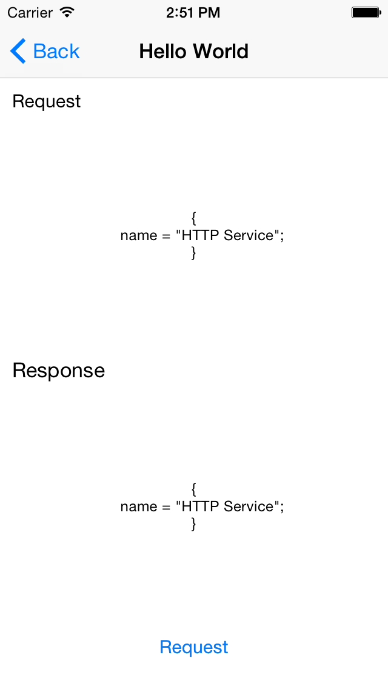

IQHTTPService
=============
Make Web API Client in easy way.

Screenshot
=============

Features
=============

1) Asynchronous, Synchronous request.

2) Multipart-Form-data upload.

3) GET, POST, PUT, DELETE support.

4) urlEncoded style and json style request.

5) Easy blocks for Upload Progress, Download, Progress, HTTP Response and Completion.

Sample PHP Code
=============

You can also find sample php code to handle GET, POST and multipart-form-data requests.

Sample Demo Project
=============

***IQParseSDK*** is a nice library that uses ***IQHTTPService*** by subclassing it. You can find demo here to know how to use it:-

***https://github.com/hackiftekhar/IQParseSDK***
